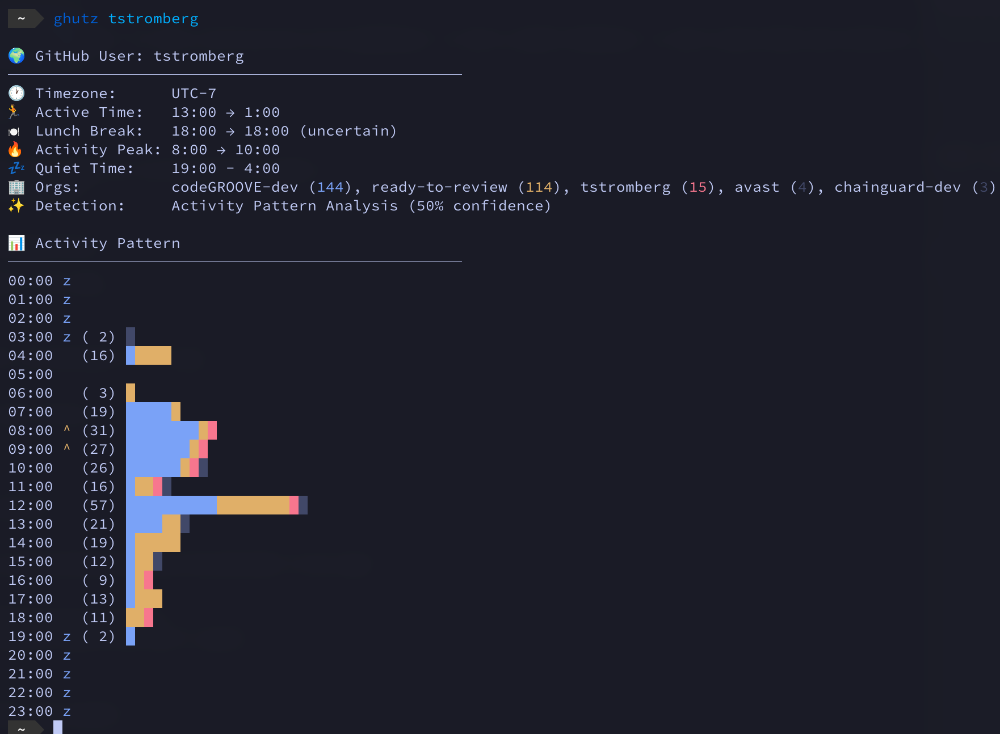

<div align="center">
  
  
  # ghuTZ 🕵️
  
  [](https://github.com/codeGROOVE-dev/ghuTZ)
  [](https://goreportcard.com/report/github.com/codeGROOVE-dev/ghuTZ)
  [](go.mod)
  
  **Stalks GitHub users to figure out where they live** 🌍  
  *(for perfectly legitimate timezone coordination purposes)*
</div>

---

## What Is This Madness?

Ever wondered when your favorite open source maintainer is actually awake? Tired of pinging someone at 3am their time? **ghuTZ** is here to help by being *slightly creepy* in the name of better collaboration.

We analyze GitHub activity patterns with the determination of a caffeinated detective to figure out where on Earth someone codes from. It's like GeoGuessr, but for developers!

<div align="center">
  
  <br><sub><i>Our detective UI tracking down timezones since 2024</i></sub>
</div>

## Quick Start

```bash
# Install it
go install github.com/codeGROOVE-dev/ghuTZ/cmd/ghutz@latest

# Stalk someone (respectfully)
ghutz torvalds

# Start the web detective agency
ghutz-server
# Visit http://localhost:8080 for the full experience
```

## How It Works

Our digital detective employs **8+ methods** to triangulate a user's timezone:

🔍 **The Sherlock Suite:**
- Scrapes GitHub profiles for local time (elementary!)  
- Geocodes location fields ("San Francisco" → UTC-8)
- Analyzes commit patterns (night owls vs early birds)
- Detects lunch breaks (everyone eats, right?)
- AI detective persona interrogates the data
- And more tricks up our sleeve...

> **Fun Fact:** Evening activity (7-11pm) is our secret weapon. That's when the real coding happens – no meetings, no Slack, just pure commits.

## For the Paranoid

Need API keys for maximum stalking efficiency:

```bash
export GITHUB_TOKEN="ghp_..." # More API calls = more data
export GOOGLE_MAPS_API_KEY="..." # Turn "NYC" into coordinates
export GEMINI_API_KEY="..." # Our AI detective assistant
```

Don't have them? No worries, we'll still try our best with public data.

## Library Usage

```go
import "github.com/codeGROOVE-dev/ghuTZ/pkg/ghutz"

detector := ghutz.New(ctx)
result, _ := detector.Detect(ctx, "octocat")

fmt.Printf("%s probably lives in %s (confidence: %.0f%%)\n", 
    result.Username, result.Timezone, result.Confidence*100)
// Output: octocat probably lives in America/Los_Angeles (confidence: 85%)
```

## The Fine Print

- **Accuracy:** Pretty good! We nail it most of the time, especially for active users
- **Privacy:** We only use public GitHub data (but still, kinda creepy)
- **Caching:** Results cached for 20 days (people don't move *that* often)
- **Speed:** Under 2 seconds per detection (detective work takes time)

## Contributing

Found a bug? Want to add a detection method? PRs welcome! Just remember:
1. Keep it simple (Rob Pike would approve)
2. Keep it ethical (no actual stalking)
3. Keep it fun (boring code is bad code)

## License

MIT – Because sharing is caring (and timezone detection should be free)

---

<div align="center">
  <sub>Made with 🔍 and questionable ethics by <a href="https://codegroove.dev">codeGROOVE</a></sub>
  <br>
  <sub><i>Remember: With great timezone detection comes great responsibility</i></sub>
</div>